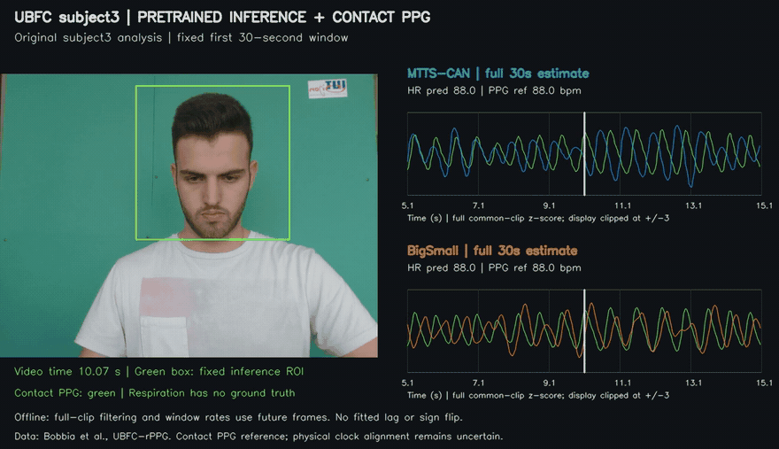
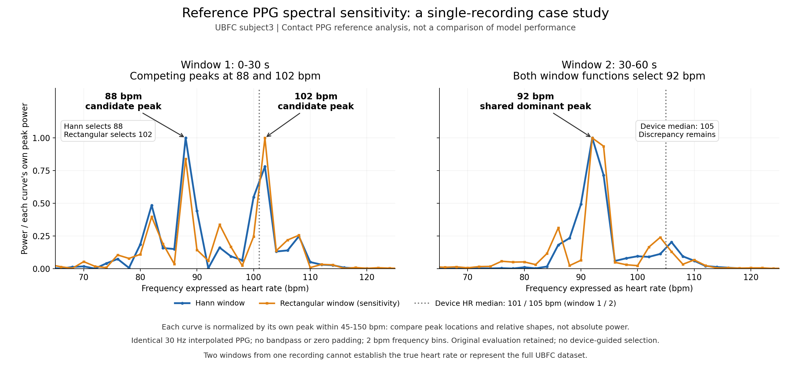

# Video-Based Human Physiological Sensing

Pulse and respiration estimation from facial videos with pretrained **MTTS-CAN** and **BigSmall**.

[](results/ubfc_gt_review/video_with_gt.mp4)

**8-second preview (10–18 s) · [Full 30-second video](results/ubfc_gt_review/video_with_gt.mp4) · [Static preview](results/ubfc_gt_review/preview.jpg)** — actual face crop, two model predictions, and the contact PPG reference. The GIF plays at original speed with reduced frame rate; heart-rate values use the full 30-second window. Offline analysis; no fitted delay or signal flip.

More demos: [Subject 1](results/ubfc_replication_uploaded_v1/subject1/video_with_reference.mp4) · [Subject 4](results/ubfc_replication_uploaded_v1/subject4/video_with_reference.mp4) · [Subject 5](results/ubfc_replication_uploaded_v1/subject5/video_with_reference.mp4)

## Results

Fixed 30-second Hann estimates, in **bpm**:

| Recording | Window (s) | PPG reference | MTTS-CAN | BigSmall | Device HR median |
|---|---|---:|---:|---:|---:|
| Subject 3 | 0–30 | 88 | 88 | 88 | 101 |
| Subject 3 | 30–60 | 92 | 92 | 92 | 105 |
| Subject 1* | 0–30 | 106 | 106 | 106 | 104 |
| Subject 4* | 0–30 | 98 | 98 | 98 | 113 |
| Subject 5* | 0–30 | 98 | 98 | 98 | 99 |

**Matching 2 bpm frequency bins does not prove accurate heart rate or matching waveforms.** Subject 4 has competing reference peaks and near-zero waveform correlations; BigSmall correlations change sign across recordings. Device HR discrepancies remain unresolved. Respiration outputs have no corresponding ground truth.

\* Separately frozen supplemental analysis removes one exactly repeated GT record per recording. Original strict failures remain recorded; incomplete second windows are not evaluated. [Full results and protocol](docs/ubfc_uploaded_replication.md).

Additional experiment: the [MPU sample](docs/gt_followup.md) produced substantial errors—MAE **24.50 bpm** for MTTS-CAN and **19.00 bpm** for BigSmall across four windows; this is not a model ranking.

<details>
<summary><strong>Reference check: why a matching peak is not enough</strong></summary>



For subject3, changing the spectral window switches the first reference peak from **88 to 102 bpm**. The second stays at **92 bpm**, still different from the device median of 105. Curves are independently peak-normalized; absolute power is not comparable. This analyzes the contact PPG reference, not model performance. Original evaluation results are retained. [Detailed audit](docs/ubfc_diagnostics.md).

</details>

## Data & environment

| Data | Used here | Local directory |
|---|---|---|
| [UBFC-rPPG](https://sites.google.com/view/ybenezeth/ubfcrppg) | Subjects 1, 3, 4, 5; facial video + contact PPG / device HR | `data/ubfc_subjectN/` |
| [MPU public sample](https://figshare.com/articles/dataset/MPU-rPPG_Sample_Dataset/29377835) | One video + contact PPG / device HR | `data/mpu_sample/` |
| [MIT EVM clip](https://people.csail.mit.edu/mrub/evm/) | Video-only inference demo; no synchronized reference | `data/mit_face.mp4` |

Download source data separately. UBFC uses `ground_truth.txt` alongside the video; exact filenames and processing settings are recorded in `configs/`. Raw data and weights are excluded from Git; the four rendered demonstration videos are included.

**Tested on Linux, Python 3.11, with `ffmpeg` / `ffprobe`; inference runs on CPU.**

| Environment | Main versions |
|---|---|
| `.venv` — MTTS-CAN, preprocessing and evaluation | TensorFlow CPU 2.15.1 · NumPy 1.26.4 · SciPy 1.12.0 |
| `.venv-bigsmall` — BigSmall model | PyTorch 2.0.1+cu117 · NumPy 1.26.0 |

```bash
bash scripts/setup_cpu.sh  # MTTS environment, pinned upstream code/weights, MIT clip
.venv/bin/python scripts/infer_mtts.py --config configs/mit_face.json
# After preparing the separate .venv-bigsmall environment:
.venv/bin/python scripts/infer_bigsmall.py --config configs/bigsmall_mit_face.json
```

Dependencies: [requirements.txt](requirements.txt) · [tested lockfile](requirements-lock.txt). BigSmall environment setup and dataset-specific commands: [reproduction guide](docs/reproduction.md). Model versions and checkpoint hashes: [sources.json](configs/sources.json).

## What is included

Pretrained inference, checkpoint and preprocessing checks, fixed evaluation protocols, time-axis and reference-spectrum audits, and video visualization. **No training or fine-tuning.** Models and data are credited to their original authors; this project's contribution is the implementation and evaluation workflow.

[Methods](docs/methods.md) · [Run the code](docs/reproduction.md) · [Data and sources](docs/data.md) · [Attribution](ATTRIBUTION.md) · [Public files](docs/publication.md)
