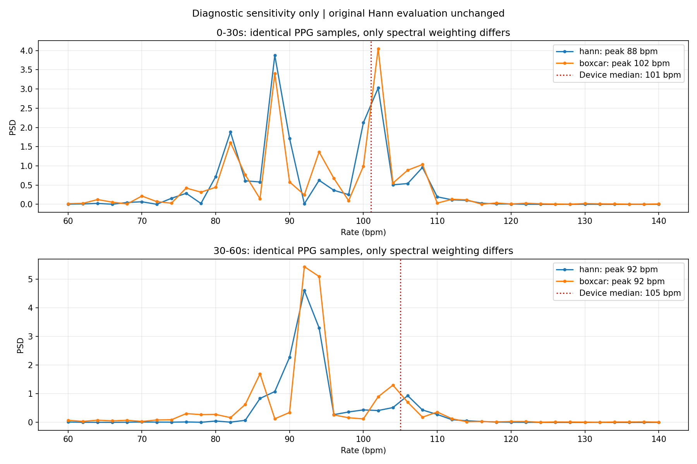

# UBFC subject3：时间轴、参考频谱与 BigSmall 极性核查

确实发现了影响结论的问题：第一窗接触 PPG 存在多个竞争峰，主峰对频谱窗函数敏感。因此，原来的“两个模型对 PPG 频谱 HR 的 MAE=0”只能解释为既定协议下落在相同的 2 bpm 频率格点，不能直接解释为真实心率准确或波形正确。第二窗 PPG 频谱与设备 HR 的差异仍未解释。没有据此更换主评价协议、调参、选择窗口、搜索时延或翻转信号。

本次仅添加诊断文件。原模型输出、评价 JSON、视频、可视化和原协议均保留；逐文件 SHA-256 校验见 preserved_artifacts.json (local artifact: `results/ubfc_diagnostics/preserved_artifacts.json`)。原报告 [ubfc_report.md](ubfc_report.md) 保留原貌，以本报告补充其适用范围和未解决问题。

**逐窗精确结果**

窗口均为左闭右开。原评价由完整序列去趋势（λ=100）、一阶 Butterworth 0.75–2.5 Hz 双向滤波，再按 30 秒截窗；使用 Hann periodogram，无零填充。模型预测使用正向累加后的信号，参考使用接触 PPG。完整浮点输出及每个模型各自的采样信息见 [exact_windows.csv](../results/ubfc_diagnostics/exact_windows.csv) 和 [audit.json](../results/ubfc_diagnostics/audit.json)。

| 窗口 / 秒 | PPG 峰 / Hz | PPG HR / bpm | MTTS-CAN / bpm | BigSmall / bpm | 设备 HR 样本均值 / bpm | 设备 HR 中位数 / bpm |
|---|---:|---:|---:|---:|---:|---:|
| 0,30) | 1.4666666666666666 | 88 | 88 | 88 | 100.23756546275395 | 101 |
| [30,60) | 1.5333333333333332 | 92 | 92 | 92 | 102.37860202931228 | 105 |

MTTS 每窗 900 点、30 Hz；BigSmall 每窗 750 点、25 Hz。两者 Δf 均为 1/30 Hz，即 2 bpm，主峰分别为第 44、46 个频率格点。以上小数表示计算结果，不能解释为同等物理测量精度。

设备 HR 两窗范围分别为 95–106、92–108 bpm；按时间零阶保持加权的均值分别为 100.2144301、102.37010233333334 bpm。“两个窗口均高 13 bpm”只对中位数汇总成立：样本均值差分别是 12.23756546275395、10.37860202931228 bpm，不能据此推断固定 +13 bpm 标定误差。

**时间轴和窗口对应关系**

原视频共 1801 帧；GT 三行也均为 1801 个值，数值有限。原 TXT 到 CSV 的 PPG、时间、设备 HR 三列逐值一致，没有把设备 HR 当波形或将秒当毫秒。视频容器 fps 为 29.548271，末帧 PTS 为 60.917270 秒，包含末帧时长约 60.951112842 秒。GT 时间为 0–60.929 秒，平均采样率按 `(N−1)/(t_last−t_first)` 计算，为 29.5425823499483 Hz。

GT 采样并非严格均匀：间隔最小/中位/最大约 0.011/0.034/0.239 秒，无倒序或重复时间戳。`1/median(dt)=29.411764705883286 Hz` 不是整段平均采样率。超过 100 ms 的间隔有 5 个，原协议已固定允许不超过 0.25 秒的线性插值；本次未改此限制。诊断只能验证发布的数据，不能恢复未提供的设备原始采样流。

| 窗口 | GT 索引，零基、右端不含 | GT 数量 | GT 首/末时间 / 秒 | 窗内有效平均 Hz | MTTS 输出索引 | BigSmall 输出索引 |
|---|---|---:|---|---:|---|---|
| [0,30) | [0,886) | 886 | 0 / 29.962 | 29.537414057806554 | [0,900) | [0,750) |
| [30,60) | [886,1773) | 887 | 30.003 / 59.993 | 29.54318106035345 | [900,1800) | [750,1500) |

两模型对应原视频帧范围分别为 0–885、886–1772（范围端点包含，并非说明每个原帧都被使用）。MTTS 目标时间与最终使用的原帧 PTS 最大绝对差为 0.016907、0.016909 秒；BigSmall 因经过 30 Hz 再到 25 Hz 的两级取帧，最大总差为 0.030240、0.030206 秒。后者不同于只检查第二级得到的约 0.013333 秒，不能混用。

每个预测点的目标时间、实际原视频帧和 PPG 插值左右邻点已导出：

- [MTTS 窗1映射 (local artifact: `results/ubfc_diagnostics/mtts_window1_mapping.csv`)、窗2映射 (local artifact: `results/ubfc_diagnostics/mtts_window2_mapping.csv`)
- BigSmall 窗1映射 (local artifact: `results/ubfc_diagnostics/bigsmall_window1_mapping.csv`)、窗2映射 (local artifact: `results/ubfc_diagnostics/bigsmall_window2_mapping.csv`)

相同索引的 `GT 时间 − 视频容器 PTS` 最小/中位/最大为 −0.113137 / 0.071242 / 0.373022 秒。点数相同、总时长相近不等于硬件严格同步；AVI 的均匀容器时间不能恢复真实曝光时刻。现有发布文件不足以判定这些差异来自采集抖动、对齐处理还是设备延迟，未估计或补偿任何时移。

将 29.548271 错当 30 Hz 仅产生约 1.528783% 的整体比例差；把 88/92 映射到设备中位数 101/105 则需约 14.772727% / 14.130435% 的比例变化，不能由该帧率差直接解释。保持其余算法不变的一次性时间解释诊断为：

| PPG 时间解释 | 第一窗 Hann 峰 / bpm | 第二窗 Hann 峰 / bpm |
|---|---:|---:|
| 原始 GT 时间戳 | 88 | 92 |
| 相同索引的视频容器 PTS | 88 | 92 |
| 直接用索引/30 秒 | 88 | 94 |

这不是替换 GT 的依据，仅说明这些简单时间解释未能解释 13 bpm 差异。[原始时钟与设备 HR 图](../results/ubfc_diagnostics/timing_and_device_hr.png)。

**接触 PPG 的真值频谱：发现主峰不稳定**

[完整参考频谱图](../results/ubfc_diagnostics/reference_spectra.png) 同时给出原始插值 PPG、去趋势 PPG、原评价滤波 PPG，以及直接使用不均匀 GT 时间戳的 Lomb–Scargle 谱。原始/去趋势/滤波三个阶段的 Hann 主峰均为 88/92 bpm，说明这两个峰并非由现有带通滤波步骤才产生。

随后为分离重采样和谱加权的影响，对完全相同的 30 Hz 原始插值 PPG 做了 Hann 与矩形窗比较，未施加带通或改变搜索频带。这是看到多峰后新增的定位诊断，不是预注册主评价，也没有用于替换主结果。

| 分析方式 | 第一窗主峰 / bpm | 第二窗主峰 / bpm |
|---|---:|---:|
| 同样本 Hann、无零填充 | 88 | 92 |
| 同样本矩形窗、无零填充 | 102 | 92 |
| 原始不均匀时间戳、无 Hann 的 Lomb–Scargle | 101.46 | 91.56 |

Lomb 频率搜索间隔是 0.001 Hz（0.06 bpm），只是诊断网格加密，不代表获得了 0.06 bpm 的实际精度；它还改变了估计方式和时间加权，不能把与设备接近作为选用它的理由。

第一窗 Hann 的 88、102 bpm 两峰 PSD 分别为 3.8767045049526265、3.027384134875176；矩形窗则分别为 3.406767712008104、4.051690416001322，两峰次序交换。第二窗 Hann 的 92 bpm 主峰 PSD 为 4.60991522785058，而 106 bpm 次峰为 0.934467040038074；矩形窗仍以 92 bpm 为主峰。因此第一窗存在实质性的选峰敏感性，第二窗仍有 PPG 与设备 HR 不一致，尚不能给出唯一原因。



[完整 PSD CSV 窗1](../results/ubfc_diagnostics/window1_window_function_spectra.csv)、[窗2](../results/ubfc_diagnostics/window2_window_function_spectra.csv)；[诊断配置与各峰数值](../results/ubfc_diagnostics/window_sensitivity.json)。原评价预测/参考 PSD 也分别保存在 `results/ubfc_diagnostics/{mtts,bigsmall}_window{1,2}_spectrum.csv`。

固定 10 秒、互不重叠的补充检查如下，仅用于观察随时间变化；其 6 bpm 频率间隔比主评价更粗，不能用来替换评价或声称设备更准确。

| 窗口 / 秒 | PPG Hann 主峰 / bpm | 设备 HR 中位数 / bpm |
|---|---:|---:|
| [0,10) | 96 | 96 |
| [10,20) | 102 | 101 |
| [20,30) | 102 | 102 |
| [30,40) | 102 | 106 |
| [40,50) | 90 | 108 |
| [50,60) | 90 | 94 |

[参考 PPG 时频图](../results/ubfc_diagnostics/reference_time_frequency.png) 使用固定 10 秒 Hann 窗、1 秒步长、无零填充，每列按其自身最大功率归一化。30 秒主峰不等于三个 10 秒主峰的平均；当前数据不能仅靠单一主峰概括其频率组成，也不能仅凭上表推断设备延迟。

**设备 HR 字段定义**

官方发布的 README 本地存档 (local artifact: `results/gt_search/ubfc_readme.txt`) 明确区分 Dataset1 的毫秒列和 Dataset2 的秒时间行。当前 Dataset2：第 1 行 PPG，第 2 行设备 HR，第 3 行秒时间戳。官方示例处理脚本存档 (local artifact: `results/gt_search/ubfc_official_processor.py`) 使用相同定义。作者明确说明其评价比较远程 PPG 和接触 PPG 推导的心率，没有使用传感器直接提供的 HR 值作为其评价参考。

[数据集作者页面](https://sites.google.com/view/ybenezeth/ubfcrppg) 说明采用 CMS50E 透射式脉搏血氧仪提供 PPG 与心率。已查到的公开说明没有给出 subject3 的设备 HR 估计算法、平均窗口、输出延迟、固件或发布前对齐细节，不能将该行视为逐点瞬时心率、独立 ECG 标注，或认定其与每个 30 秒 FFT 峰应当严格相等。

本文件设备 HR 在相邻样本间改变 46 次，大多数为重复整数，但存在 15 个非整数样本（例如 95.2、96.333、99.5）。这提示不能将发布值一概称作“原始整数显示值”；其形成机制未查明，不能由这些小数反推确定的平滑或插值算法。

**BigSmall 极性与后处理**

以下针对当前使用的 rPPG-Toolbox 代码版本 `b7500b848f84ad7f86e277b4612563b69f4f88f9` 及当前保存输出。

- 导出的原始 BVP head 与保存的 `pulse_raw_difference` 最大绝对差为 **0.0**；`np.cumsum(raw_difference)` 与保存的 `pulse_integrated` 差为 **0.0**；按原配置 0.6–3.3 Hz 重算原生滤波结果差为 **0.0**。没有发现包装器偷偷取负或导出时改变符号。
- [官方 BaseLoader](https://github.com/ubicomplab/rPPG-Toolbox/blob/b7500b848f84ad7f86e277b4612563b69f4f88f9/dataset/data_loader/BaseLoader.py#L615) 定义标签差分为 `label[t+1] - label[t]`，再除以标准差；[官方后处理](https://github.com/ubicomplab/rPPG-Toolbox/blob/b7500b848f84ad7f86e277b4612563b69f4f88f9/evaluation/post_process.py#L131) 对差分输出做正向累加和去趋势。本地符号约定一致。差分后累加相对于原始标签存在一个样本的索引约定，不能据此推导全局反号；本次没有移动信号。
- [官方训练器](https://github.com/ubicomplab/rPPG-Toolbox/blob/b7500b848f84ad7f86e277b4612563b69f4f88f9/neural_methods/trainer/BigSmallTrainer.py#L146) 的 BVP 训练标签是 `pos_env_norm_bvp`，测试标签是 `bp_wave`；BVP 损失是 MSE，并非符号不敏感损失。不能说“模型训练不在乎正负”。
- [官方 BP4D+ loader](https://github.com/ubicomplab/rPPG-Toolbox/blob/b7500b848f84ad7f86e277b4612563b69f4f88f9/dataset/data_loader/BP4DPlusBigSmallLoader.py#L290) 从 RGB 用 POS 投影生成伪 PPG，以训练数据的平均 HR 设置频带，再除以 Hilbert 包络；没有将其逐段与接触 PPG 自动对齐极性。因此不能假定这个训练目标与 UBFC 透射式 PPG 具有固定相位/极性关系。这是目标定义差异，尚不是本例负相关的已证实原因；本次推理未使用 UBFC HR 来设置频带。

| 窗口 | MTTS 零时延 Pearson r | BigSmall 零时延 Pearson r | BigSmall 相对 GT 主峰相位 / 度 |
|---|---:|---:|---:|
| [0,30) | 0.12692157904678306 | −0.37077575840014143 | −85.76624431252355 |
| [30,60) | 0.6112096308164701 | −0.6379251008027926 | −153.93448005173767 |

相位由现有共同滤波结果的 Hann 复频谱计算，没有时延搜索、绝对值相关或翻转。两窗不呈一致的 180° 关系，负 Pearson 不足以证明只需全局取负；频率混合、模型误差及真实时间关系仍有不确定性。功率谱本身对信号取负不变，所以 HR 相同不能验证极性，也不能验证波形正确。

**本次可支持的结论与仍缺的证据**

没有在列读取、秒/毫秒、30/25 Hz FFT 使用或软件窗口索引中发现足以解释差异的错误。已确认第一窗参考主峰不稳健，设备 HR 的不同汇总也并非恒定 +13 bpm；原 MAE=0 应限于指定处理协议的两个窗口。硬件同步、设备 HR 平均/延迟及 BigSmall 在本数据上的相位关系仍未查明。进一步确定生理心率需要设备原始采样/同步记录或独立逐搏参考，现有发布文件不足以完成这一判断。

复现命令（读取现有输出，无需重新推理）：

```bash
.venv/bin/python scripts/diagnose_ubfc.py
.venv/bin/python scripts/diagnose_ubfc_spectral_windows.py
```

文件保存于 `results/ubfc_diagnostics/`。本报告仅核查 subject3 当前两个窗口，不构成两模型总体性能结论。
