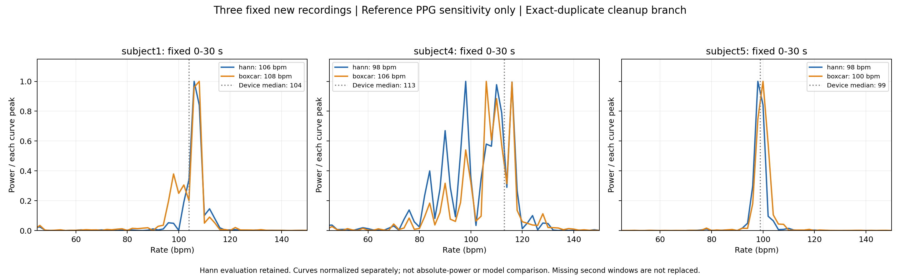
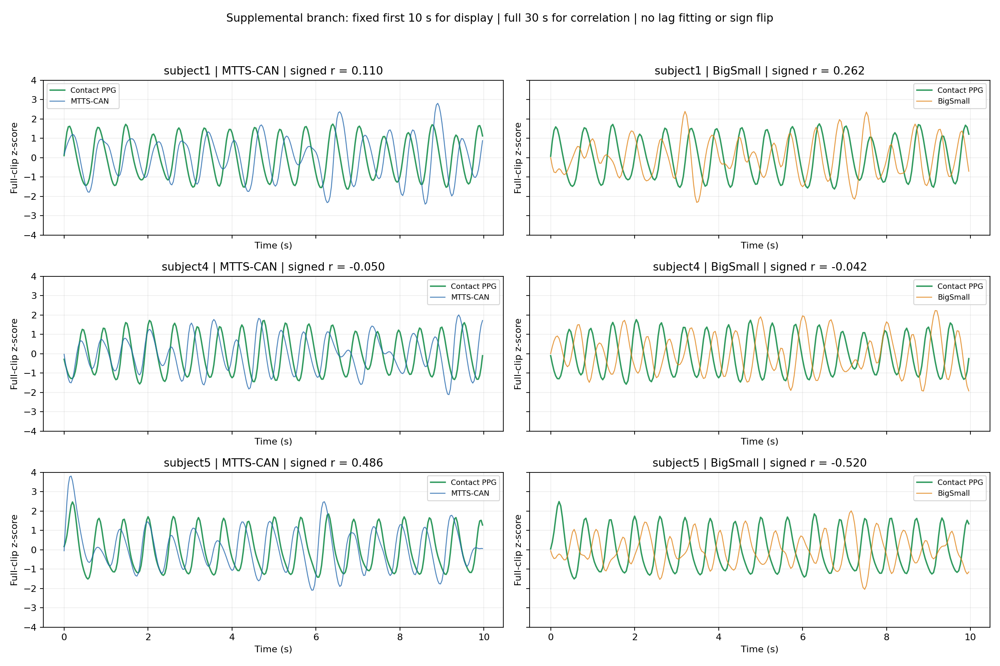

# 新上传 UBFC 小样本：两模型推理与补充评价

已完成冻结清单 subject1、subject4、subject5 的两模型推理。用户上传文件分别为 `vid_sub1.avi`、`sub4.avi`、`sub5.avi`，均与先前记录的官方视频字节数一致，且解码帧数与原始 GT 点数一致。subject3 作为探索参照保留原结果和视频；本次未重新推理或替换它。

**这里报告的是单独固定的“完全重复 GT 清理”补充分支，不能覆盖原严格主分析。** 原 GT 每段都有一对完全相同的时间、PPG、设备 HR 记录；原严格时间要求仍记为失败。补充分支在新增模型输出和频谱检查前固定，只保留完全重复记录中的第一条，原始文件不动、视频帧不删、时间与幅值不改。对于不同值的同时间记录或逆序时间则直接停止。

原清单、频带、模型权重、30/25 Hz 输入、30 秒 Hann 无零填充估计、去趋势/滤波、零时延与信号极性全部沿用。首帧 ROI 在新频谱或预测出现前固定。清理规则是在发现重复记录后制定的明确补充协议，不应说成原分析事先就允许了这一处理。

[原冻结协议](../configs/ubfc_replication_v1.json) · [补充分支冻结协议](../configs/ubfc_replication_exact_duplicate_v1.json) · 首帧 ROI (local artifact: `results/ubfc_replication_uploaded_v1/frozen_first_frame_rois.jpg`) · [逐样本完整性核查](../results/ubfc_replication_uploaded_v1/upload_inventory.json)

每段只有 [0,30) 秒是完整固定窗口；[30,60) 秒均不完整，未补齐、缩短或替换。按不同口径分别报告：原严格主分析 0/6 窗可评价；补充分支 3/6 窗可评价、3/6 窗缺失；subject3 不混入新增统计。

**逐窗结果：以下均为固定 [0,30) 秒，单位 bpm**

| 样本 | 接触 PPG HR，30/25 Hz 网格 | MTTS-CAN | BigSmall | 设备 HR 中位数 | 设备 HR 均值 |
|---|---:|---:|---:|---:|---:|
| subject1 | 106 / 106 | 106 | 106 | 104 | 103.831834 |
| subject4 | 98 / 98 | 98 | 98 | 113 | 111.527215 |
| subject5 | 98 / 98 | 98 | 98 | 99 | 99.482777 |

设备 HR 汇总使用发布文件该窗口的原始样本，包含原记录，不从模型预测推导。模型/PPG 的主评价频率格间距为 2 bpm；相同格点不代表波形正确或真实生理心率被确定。完整精度及缺失窗口状态见 [supplemental_exact_windows.csv](../results/ubfc_replication_uploaded_v1/supplemental_exact_windows.csv)；原严格状态单独保存在 [original_strict_status.csv](../results/ubfc_replication_uploaded_v1/original_strict_status.csv)。

| 模型 | 补充分支 MAE | RMSE | 平均偏差 |
|---|---:|---:|---:|
| MTTS-CAN | 0.000000 | 0.000000 | 0.000000 |
| BigSmall | 0.000000 | 0.000000 | 0.000000 |

这些仅是三个单窗口的描述性数字，不用于总体精度或模型优劣排名。

**参考竞争峰是否重复出现**

使用此前冻结的敏感性分析：相同 30 Hz 原始插值 PPG、无带通、均值去除、无零填充，分别计算 Hann 和矩形窗。竞争峰标记要求 Hann 最大的两个内部局部峰相距至少 6 bpm，第二/第一峰功率比至少 0.5；窗函数变化标记要求主峰相差至少 4 bpm。两项均为描述标记，不是排除标准。

| 样本 | Hann 主峰 | 矩形窗主峰 | Hann 第二局部峰 | 次峰/主峰功率比 | 竞争峰标记 | 窗函数变化标记 |
|---|---:|---:|---:|---:|---|---|
| subject1 | 106 | 108 | 112 | 0.145938607 | False | False |
| subject4 | 98 | 106 | 116 | 0.995783512 | True | True |
| subject5 | 98 | 100 | 110 | 0.014789869 | False | False |

新增三窗中，竞争峰标记为 **1/3**，窗函数变化标记为 **1/3**。subject4 的 98 与 116 bpm 两个 Hann 峰几乎等高，矩形窗选中 106 bpm：参考主峰不稳定现象在另一个受试者上出现。subject1、5 的次峰明显较弱，不能把 subject3 的双峰现象推广为所有录像共有。没有按设备值改选谱窗，敏感性结果不替换模型评价。



每条曲线按自身 45–150 bpm 内峰值归一化，不能用于比较绝对功率。这是参考 PPG 图，不是模型性能比较。[精确敏感性表](../results/ubfc_replication_uploaded_v1/supplemental_sensitivity.csv)；各样本子目录保留完整 PSD CSV 及局部峰列表。

**波形与极性**

| 样本 | MTTS 有符号 Pearson r | BigSmall 有符号 Pearson r | MTTS 在 GT 主峰处相位 / 度 | BigSmall 在 GT 主峰处相位 / 度 |
|---|---:|---:|---:|---:|
| subject1 | 0.110334858 | 0.261989103 | -85.586279 | 61.781400 |
| subject4 | -0.050184288 | -0.042287416 | 110.053217 | -82.850451 |
| subject5 | 0.485794331 | -0.520341660 | 66.618774 | -118.085153 |

r 在完整首个 30 秒窗计算，无时延拟合、绝对值相关或翻转；相位仅是单频点诊断。BigSmall 在 subject1 为正相关，已经说明 subject3 的负相关不能直接推广为“所有 BigSmall 输出都应取负”。频率格点一致也并不保证波形吻合。原始差分到保存积分结果的正向累加复算误差均为 0；没有修正极性。



图仅展示预先固定的首 10 秒，纵轴为完整共同序列各自 z-score；评价使用完整 30 秒。硬件时间同步仍未独立验证，所以不能把相位或相关性差异唯一归因于模型或传感器。

**逐段视频可视化**

- [subject1：视频、实际 ROI、两模型和接触 PPG](../results/ubfc_replication_uploaded_v1/subject1/video_with_reference.mp4)
- [subject4：视频、实际 ROI、两模型和接触 PPG](../results/ubfc_replication_uploaded_v1/subject4/video_with_reference.mp4)
- [subject5：视频、实际 ROI、两模型和接触 PPG](../results/ubfc_replication_uploaded_v1/subject5/video_with_reference.mp4)

每段固定 30 秒、900 帧。视频标明补充分支、完整窗口 HR 和离线滤波，不是实时测量。波形仅显示时将幅值裁剪到 ±3 个标准差；评价数组未裁剪。没有呼吸真值，不给出呼吸准确性指标。

**时间轴、清理与结果保护**

| 样本 | 原视频帧/原 GT 点 | 容器 Hz | 末帧 PTS / 秒 | GT 末时刻 / 秒 | 移除的零基重复 GT 索引 | 清理后最大间隔 / 秒 |
|---|---:|---:|---:|---:|---:|---:|
| subject1 | 1547 / 1547 | 29.264106 | 52.829224 | 52.691000 | 495 | 0.223000 |
| subject4 | 1368 / 1368 | 29.609362 | 46.167830 | 46.234000 | 858 | 0.157000 |
| subject5 | 1550 / 1550 | 29.661806 | 52.222039 | 52.368000 | 20 | 0.152000 |

移除的是完全相同的重复列，而不是某一段波形；同时间位置的数值和后续时间戳保持原样。两模型首个 30 秒网格上的原/去重 GT 线性插值最大绝对差均为 **0.0**。这解释了此清理只消除数据表示中的重复，但不应将补充分支伪装为原严格分析已经通过。

每段子目录的 `gt_source_index_mapping.csv` 保存清理后索引到原 GT 索引；`source_timing.csv` 保存原视频 PTS 与原 GT 时间；`resampling.csv` 保存输入取帧关系；`{mtts,bigsmall}_window1_mapping.csv` 保存预测点、实际原帧和 GT 插值邻点。容器 PTS 与 GT 时间依然存在偏差，点数匹配不证明硬件同步。

无损重采样抽检 0、15、30、45 秒原帧像素一致。subject3 视频 SHA-256 与此前一致，94 个既有结果文件逐文件哈希未变。各模型权重和处理参数也与 subject3 的原运行一致。[验证记录](../results/ubfc_replication_uploaded_v1/verification.json)。

复现和检查入口：

```bash
# 首次生成新分支；已存在准备好的输入时会拒绝覆盖
.venv/bin/python scripts/run_ubfc_uploaded_replication.py
# 已有推理结果的报告、视频和核验
.venv/bin/python scripts/review_ubfc_uploaded_replication.py
.venv/bin/python scripts/render_ubfc_uploaded_reviews.py
.venv/bin/python scripts/verify_ubfc_uploaded_replication.py
.venv/bin/python scripts/write_ubfc_uploaded_report.py
```

视频生成脚本也拒绝覆盖已有成片。所有新增文件在 `results/ubfc_replication_uploaded_v1/`，没有发布或上传外部平台。
